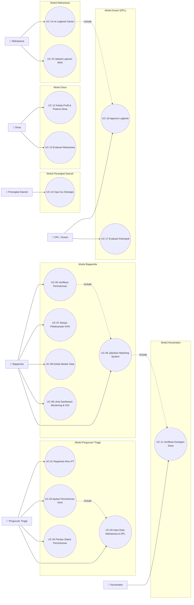

# 02 — Use Case Diagram & Narasi
## SIMPUL-KKN

Dokumen sebelumnya: `00-design-system.md`, `01-prd.md`

Catatan: "Masyarakat" tidak dijadikan aktor sistem tersendiri (tidak memiliki akun/interaksi langsung), melainkan disebut sebagai **pihak penerima manfaat/dampak** dari pelaksanaan KKN — direpresentasikan secara tidak langsung melalui input Desa (potensi, permasalahan, kebutuhan) dan output Dashboard Evaluasi (kepuasan desa, dampak sosial-ekonomi).

---

## 1. Diagram Use Case Utama (Overview)

Diagram berikut mencakup use case **utama (Must-priority)** dari seluruh 7 aktor. Use case pendukung/minor (edit profil, lihat rekap, dsb) dijabarkan di narasi masing-masing modul pada §2.

---

## 2. Narasi Detail per Use Case

Format tiap use case: **Aktor, Deskripsi, Precondition, Main Flow, Alternate/Exception Flow, Postcondition.**

### Modul Perguruan Tinggi

#### UC-01 — Registrasi Akun PT
| Item | Detail |
|---|---|
| Aktor | Operator Perguruan Tinggi |
| Deskripsi | Mendaftarkan institusi PT sebagai pengguna baru sistem |
| Precondition | PT belum memiliki akun terdaftar |
| **Main Flow** | 1. Buka halaman registrasi 2. Isi data institusi (nama PT, alamat, PIC, email, no. telp) 3. Upload dokumen legalitas (opsional/sesuai kebijakan) 4. Submit 5. Sistem kirim status "menunggu approval" |
| Alternate Flow | 3a. Bapperida menolak registrasi → PT menerima notifikasi in-app dengan alasan penolakan, dapat mengajukan ulang |
| Postcondition | Akun PT aktif (setelah di-approve Bapperida) dan dapat login |

#### UC-02 — Ajukan Permohonan KKN
| Item | Detail |
|---|---|
| Aktor | Operator Perguruan Tinggi |
| Deskripsi | Mengajukan permohonan pelaksanaan KKN baru untuk suatu periode |
| Precondition | Akun PT sudah aktif & login |
| **Main Flow** | 1. Klik "Ajukan Permohonan Baru" 2. Isi tema KKN, bidang keilmuan, periode/jadwal, jumlah mahasiswa 3. **Include UC-03**: input/pilih data mahasiswa & DPL 4. Upload surat permohonan & proposal (PDF) 5. Submit permohonan 6. Status berubah menjadi "Menunggu Verifikasi" |
| Alternate Flow | 4a. File melebihi ukuran/format tidak sesuai → sistem tampilkan error validasi, PT upload ulang |
| Postcondition | Permohonan tercatat di sistem dan masuk antrean verifikasi Bapperida (trigger UC-05) |

#### UC-03 — Input Data Mahasiswa & DPL
| Item | Detail |
|---|---|
| Aktor | Operator Perguruan Tinggi |
| Deskripsi | Menginput data peserta KKN (mahasiswa) dan dosen pembimbing lapangan |
| Precondition | Sedang dalam proses UC-02, atau ingin menambah data di permohonan yang sudah ada |
| **Main Flow** | 1. Pilih input manual (satu-satu) atau import Excel (massal) 2. Isi/upload data mahasiswa (NIM, nama, prodi, no. HP) 3. Tautkan DPL ke kelompok mahasiswa 4. Simpan |
| Alternate Flow | 2a. Format Excel tidak sesuai template → sistem tampilkan baris error, PT perbaiki dan upload ulang |
| Postcondition | Data mahasiswa & DPL tersimpan dan tertaut ke permohonan KKN terkait |

#### UC-04 — Pantau Status Permohonan
| Item | Detail |
|---|---|
| Aktor | Operator Perguruan Tinggi |
| Deskripsi | Memantau progres verifikasi hingga persetujuan permohonan yang diajukan |
| Precondition | PT memiliki minimal satu permohonan yang pernah diajukan |
| **Main Flow** | 1. Buka halaman "Status Permohonan" 2. Lihat daftar permohonan dengan badge status (Diajukan/Diverifikasi/Disetujui/Ditolak) 3. Klik detail untuk melihat catatan/lokasi hasil matching |
| Alternate Flow | – |
| Postcondition | PT mendapat informasi terkini status permohonannya |

---

### Modul Bapperida

#### UC-05 — Verifikasi Permohonan
| Item | Detail |
|---|---|
| Aktor | Admin Bapperida |
| Deskripsi | Memeriksa kelengkapan & kelayakan permohonan KKN yang diajukan PT |
| Precondition | Ada permohonan berstatus "Menunggu Verifikasi" |
| **Main Flow** | 1. Buka daftar permohonan masuk 2. Review detail permohonan & dokumen 3. Jika lengkap & sesuai → set status "Terverifikasi", **include UC-06** 4. Jika tidak lengkap → tolak dengan catatan |
| Alternate Flow | 4a. Permohonan ditolak → notifikasi otomatis ke PT terkait dengan alasan |
| Postcondition | Permohonan berstatus Terverifikasi/Ditolak; jika terverifikasi, lanjut ke proses matching |

#### UC-06 — Jalankan Matching System
| Item | Detail |
|---|---|
| Aktor | Admin Bapperida |
| Deskripsi | Menjalankan mesin skoring rule-based untuk mendapat rekomendasi desa berdasar tema, bidang, prioritas daerah, dan kebutuhan desa |
| Precondition | Permohonan berstatus Terverifikasi |
| **Main Flow** | 1. Klik "Jalankan Matching" pada permohonan terkait 2. Sistem hitung skor kecocokan tiap desa kandidat 3. Sistem tampilkan ranking desa beserta skor & alasan (breakdown per parameter) 4. Sistem beri **flag peringatan** jika desa kandidat sudah memiliki KKN tema serupa aktif 5. Bapperida pilih desa dari ranking, atau override manual 6. Kirim ke Kecamatan terkait untuk verifikasi kesiapan (**include UC-11**) |
| Alternate Flow | 5a. Tidak ada desa dengan skor memadai → Bapperida dapat menambah kriteria pencarian manual |
| Postcondition | Desa kandidat terpilih, menunggu verifikasi kesiapan dari Kecamatan |

#### UC-07 — Setujui Pelaksanaan KKN
| Item | Detail |
|---|---|
| Aktor | Admin Bapperida |
| Deskripsi | Memberi persetujuan akhir lokasi & pelaksanaan KKN setelah kesiapan desa terverifikasi |
| Precondition | Kecamatan telah memverifikasi kesiapan desa (UC-11 selesai) |
| **Main Flow** | 1. Buka permohonan berstatus "Menunggu Persetujuan Akhir" 2. Review hasil verifikasi kecamatan 3. Approve → status "Disetujui/Aktif" 4. Sistem kirim notifikasi ke PT, Mahasiswa, DPL, dan Desa terkait |
| Alternate Flow | 3a. Bapperida menolak lokasi hasil verifikasi kecamatan → kembali ke UC-06 untuk re-matching |
| Postcondition | KKN resmi berjalan, mahasiswa dapat mulai mengisi logbook (aktifkan UC-14) |

#### UC-08 — Kelola Master Data
| Item | Detail |
|---|---|
| Aktor | Admin Bapperida |
| Deskripsi | Mengelola data referensi sistem: desa, kecamatan, daftar PT, tema prioritas daerah |
| Precondition | Login sebagai Bapperida/Admin |
| **Main Flow** | 1. Pilih jenis master data 2. Tambah/Edit/Hapus data 3. Simpan |
| Alternate Flow | 3a. Data akan dihapus masih terpakai relasi lain → sistem cegah hapus, tampilkan peringatan |
| Postcondition | Master data ter-update dan digunakan sistem secara konsisten |

#### UC-09 — Lihat Dashboard Monitoring & GIS
| Item | Detail |
|---|---|
| Aktor | Admin Bapperida (juga dapat diakses terbatas oleh PT/Kecamatan/Desa sesuai cakupan masing-masing) |
| Deskripsi | Melihat ringkasan seluruh KKN berjalan dalam bentuk statistik dan peta interaktif |
| Precondition | Login |
| **Main Flow** | 1. Buka Dashboard 2. Lihat statistik ringkas (jumlah mahasiswa, PT, desa, progres) 3. Buka tab Peta (Leaflet) untuk melihat sebaran lokasi KKN 4. Filter berdasarkan PT/tema/status/periode |
| Alternate Flow | – |
| Postcondition | Pengguna mendapat gambaran menyeluruh kondisi pelaksanaan KKN |

---

### Modul Perangkat Daerah

#### UC-10 — Input Isu Strategis
| Item | Detail |
|---|---|
| Aktor | Operator Perangkat Daerah (OPD) |
| Deskripsi | Menginput isu strategis pembangunan sesuai bidang tugas OPD, menjadi salah satu parameter Matching System |
| Precondition | Login sebagai OPD |
| **Main Flow** | 1. Buka form isu strategis 2. Isi kategori isu (stunting, UMKM, lingkungan, dsb), deskripsi, wilayah terdampak 3. (Opsional) Beri rekomendasi tema KKN terkait 4. Simpan |
| Alternate Flow | – |
| Postcondition | Isu strategis tersimpan dan tersedia sebagai parameter "Prioritas Daerah" dalam Matching System |

---

### Modul Kecamatan

#### UC-11 — Verifikasi Kesiapan Desa
| Item | Detail |
|---|---|
| Aktor | Operator Kecamatan |
| Deskripsi | Memverifikasi apakah desa kandidat hasil matching benar-benar siap menerima KKN |
| Precondition | Bapperida telah memilih desa kandidat (dari UC-06) |
| **Main Flow** | 1. Terima notifikasi permintaan verifikasi 2. Cek kondisi desa (koordinasi dengan aparat desa jika perlu) 3. Beri status "Siap"/"Tidak Siap" dengan catatan 4. Kirim rekomendasi lokasi final ke Bapperida |
| Alternate Flow | 3a. Desa "Tidak Siap" → Bapperida menerima notifikasi untuk kembali ke UC-06 (pilih desa alternatif) |
| Postcondition | Status kesiapan desa tercatat, menjadi dasar keputusan akhir Bapperida (UC-07) |

---

### Modul Desa

#### UC-12 — Kelola Profil & Potensi Desa
| Item | Detail |
|---|---|
| Aktor | Operator Desa |
| Deskripsi | Mengelola data profil desa: demografi, potensi, permasalahan, kebutuhan masyarakat |
| Precondition | Login sebagai operator desa |
| **Main Flow** | 1. Buka halaman profil desa 2. Lengkapi/update data demografi, potensi, permasalahan, kebutuhan 3. Simpan |
| Alternate Flow | – |
| Postcondition | Data desa terkini tersedia sebagai parameter "Kebutuhan Desa" dalam Matching System |

#### UC-13 — Evaluasi Mahasiswa
| Item | Detail |
|---|---|
| Aktor | Operator Desa |
| Deskripsi | Memberikan penilaian/evaluasi terhadap kelompok mahasiswa yang ditempatkan di desanya |
| Precondition | Periode KKN di desa tersebut telah/sedang berakhir |
| **Main Flow** | 1. Buka daftar kelompok mahasiswa yang pernah/sedang bertugas 2. Isi form evaluasi (kualitas program, manfaat, kedisiplinan, dsb) 3. Submit |
| Alternate Flow | – |
| Postcondition | Data evaluasi tersimpan, menjadi input Dashboard Evaluasi (kepuasan desa) |

---

### Modul Mahasiswa

#### UC-14 — Isi Logbook Harian
| Item | Detail |
|---|---|
| Aktor | Mahasiswa |
| Deskripsi | Mencatat kegiatan harian selama pelaksanaan KKN |
| Precondition | KKN berstatus "Disetujui/Aktif" (dari UC-07) |
| **Main Flow** | 1. Buka menu Logbook 2. Pilih tanggal, isi deskripsi kegiatan, upload foto dokumentasi 3. Submit 4. **Include UC-16**: logbook masuk antrean approval DPL |
| Alternate Flow | 3a. Belum isi logbook >2 hari → sistem kirim notifikasi pengingat |
| Postcondition | Logbook tercatat, menunggu approval DPL |

#### UC-15 — Upload Laporan Akhir
| Item | Detail |
|---|---|
| Aktor | Mahasiswa (perwakilan kelompok) |
| Deskripsi | Mengunggah laporan akhir dan luaran kegiatan KKN di akhir periode |
| Precondition | Periode KKN mendekati/telah selesai |
| **Main Flow** | 1. Buka menu Laporan Akhir 2. Upload dokumen laporan (PDF) & luaran kegiatan (dokumen/gambar/link) 3. Submit |
| Alternate Flow | 2a. File melebihi batas ukuran → sistem tampilkan error |
| Postcondition | Laporan akhir tercatat, dapat dilihat DPL, PT, dan Bapperida |

---

### Modul Dosen (DPL)

#### UC-16 — Approve Logbook
| Item | Detail |
|---|---|
| Aktor | Dosen Pembimbing Lapangan |
| Deskripsi | Meninjau dan menyetujui/menolak logbook harian mahasiswa bimbingan |
| Precondition | Ada logbook berstatus "Menunggu Approval" dari mahasiswa bimbingan |
| **Main Flow** | 1. Buka daftar logbook masuk 2. Review isi & dokumentasi 3. Approve, atau tolak dengan catatan revisi |
| Alternate Flow | 3a. Ditolak → mahasiswa menerima notifikasi untuk revisi & submit ulang |
| Postcondition | Logbook berstatus Disetujui/Perlu Revisi |

#### UC-17 — Evaluasi Kelompok
| Item | Detail |
|---|---|
| Aktor | Dosen Pembimbing Lapangan |
| Deskripsi | Memberikan evaluasi akhir terhadap kinerja kelompok mahasiswa bimbingan |
| Precondition | Periode KKN telah/hampir selesai |
| **Main Flow** | 1. Buka daftar kelompok bimbingan 2. Isi form evaluasi per kelompok/individu 3. Submit |
| Alternate Flow | – |
| Postcondition | Data evaluasi DPL tersimpan sebagai bagian penilaian akhir KKN |

---

## 3. Ringkasan Relasi Include/Extend

| Use Case Dasar | Relasi | Use Case Terkait | Keterangan |
|---|---|---|---|
| UC-02 (Ajukan Permohonan) | include | UC-03 (Input Mahasiswa & DPL) | Data mahasiswa wajib ada saat pengajuan |
| UC-05 (Verifikasi) | include | UC-06 (Matching System) | Matching hanya jalan setelah verifikasi lolos |
| UC-06 (Matching System) | include | UC-11 (Verifikasi Kecamatan) | Hasil matching wajib diverifikasi kecamatan |
| UC-14 (Isi Logbook) | include | UC-16 (Approve Logbook DPL) | Setiap logbook baru otomatis butuh approval |
| UC-07 (Setujui KKN) | extend | UC-14 (Isi Logbook) | Logbook baru bisa diisi setelah KKN disetujui |

---

*Dokumen berikutnya: `03-erd.md` — Entity Relationship Diagram*
