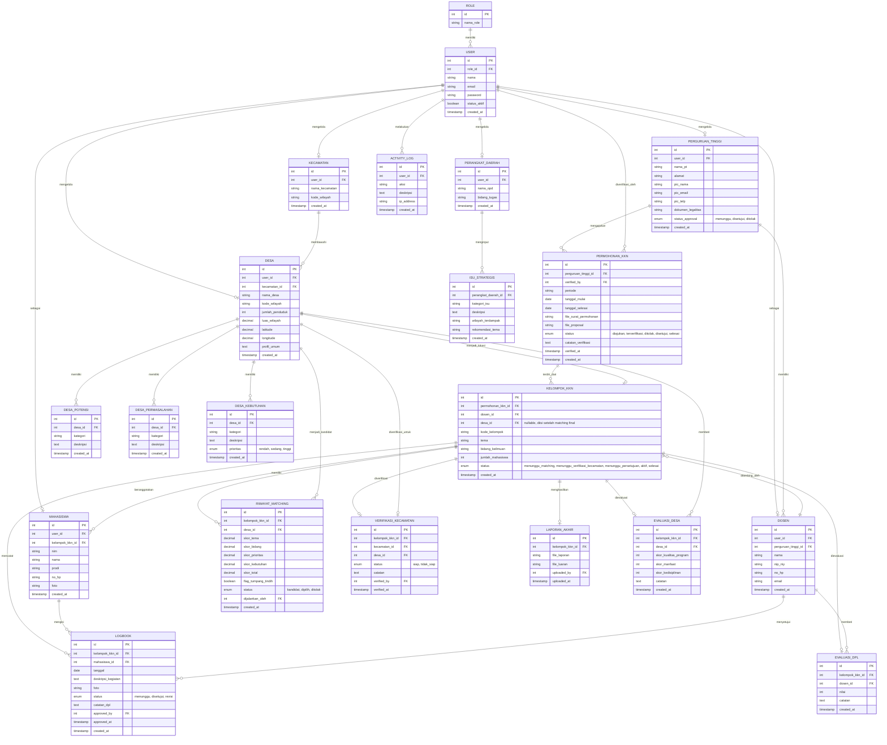

# 03 — Entity Relationship Diagram (ERD)
## SIMPUL-KKN

Dokumen sebelumnya: `00-design-system.md`, `01-prd.md`, `02-use-case.md`

**Konvensi:**
- Penamaan tabel & kolom: **Bahasa Indonesia**, `snake_case`
- Primary key: **auto-increment integer** (`id`, default Laravel)
- Foreign key: `{nama_tabel_singular}_id`
- Setiap tabel memiliki `created_at`, `updated_at` (Laravel timestamps), sebagian besar juga `deleted_at` (soft delete) — ditandai pada kamus data
- Tabel `notifications` mengikuti struktur default Laravel Notifications (UUID) — pengecualian konvensi karena mengikuti standar package

---

## 1. Diagram ERD

---

## 2. Kamus Data (Data Dictionary)

### 2.1 `role`
| Kolom | Tipe | Keterangan |
|---|---|---|
| id | int, PK | — |
| nama_role | varchar(50) | bapperida, perguruan_tinggi, mahasiswa, dosen, perangkat_daerah, kecamatan, desa, superadmin |

### 2.2 `user`
| Kolom | Tipe | Keterangan |
|---|---|---|
| id | int, PK | — |
| role_id | int, FK → role | Menentukan redirect dashboard & middleware akses |
| nama | varchar(150) | — |
| email | varchar(150), unique | Digunakan untuk login |
| password | varchar(255) | Hashed (bcrypt) |
| status_aktif | boolean | default true; dipakai untuk nonaktifkan akun tanpa hapus data |
| created_at, updated_at | timestamp | — |

> `user` adalah tabel autentikasi generik. Data spesifik per role (PT, mahasiswa, dosen, dst.) disimpan di tabel masing-masing dan tertaut via `user_id` (relasi one-to-one).

### 2.3 `perguruan_tinggi`
| Kolom | Tipe | Keterangan |
|---|---|---|
| id | int, PK | — |
| user_id | int, FK → user | Akun login PT |
| nama_pt | varchar(200) | — |
| alamat | text | — |
| pic_nama, pic_email, pic_telp | varchar | Penanggung jawab institusi |
| dokumen_legalitas | varchar(255) | Path file (opsional) |
| status_approval | enum | menunggu / disetujui / ditolak — di-set Bapperida saat UC-01 |

### 2.4 `dosen`
| Kolom | Tipe | Keterangan |
|---|---|---|
| id | int, PK | — |
| user_id | int, FK → user | Akun login DPL |
| perguruan_tinggi_id | int, FK | Asal institusi dosen |
| nama, nip_niy, no_hp, email | varchar | — |

### 2.5 `mahasiswa`
| Kolom | Tipe | Keterangan |
|---|---|---|
| id | int, PK | — |
| user_id | int, FK → user | Akun login mahasiswa (nullable jika belum aktivasi) |
| kelompok_kkn_id | int, FK | Kelompok tempat mahasiswa tergabung |
| nim, nama, prodi, no_hp | varchar | — |
| foto | varchar(255) | Path file, opsional |

### 2.6 `kecamatan`
| Kolom | Tipe | Keterangan |
|---|---|---|
| id | int, PK | — |
| user_id | int, FK → user | Akun operator kecamatan (nullable, bisa 1 akun handle banyak kecamatan via role terpisah — didiskusikan saat implementasi) |
| nama_kecamatan, kode_wilayah | varchar | Master data wilayah |

### 2.7 `desa`
| Kolom | Tipe | Keterangan |
|---|---|---|
| id | int, PK | — |
| user_id | int, FK → user | Akun operator desa |
| kecamatan_id | int, FK | — |
| nama_desa, kode_wilayah | varchar | — |
| jumlah_penduduk | int | Untuk profil & analisis dashboard |
| luas_wilayah | decimal | — |
| latitude, longitude | decimal(10,7) | **Wajib diisi untuk Dashboard GIS (Leaflet)** |
| profil_umum | text | Deskripsi umum desa |

### 2.8 `desa_potensi`, `desa_permasalahan`, `desa_kebutuhan`
Struktur ketiganya seragam (kategori + deskripsi), dipisah tabel agar query & filter per jenis lebih efisien dan sesuai KAK (Modul Desa: Profil, Permasalahan, Potensi, Kebutuhan terpisah).
| Kolom | Tipe | Keterangan |
|---|---|---|
| id | int, PK | — |
| desa_id | int, FK | — |
| kategori | varchar(100) | mis. "Pertanian", "Pendidikan", "Kesehatan" |
| deskripsi | text | — |
| prioritas *(khusus desa_kebutuhan)* | enum | rendah/sedang/tinggi — **jadi parameter Matching System** |

### 2.9 `perangkat_daerah`
| Kolom | Tipe | Keterangan |
|---|---|---|
| id | int, PK | — |
| user_id | int, FK → user | — |
| nama_opd, bidang_tugas | varchar | mis. Dinas Kesehatan / bidang stunting |

### 2.10 `isu_strategis`
| Kolom | Tipe | Keterangan |
|---|---|---|
| id | int, PK | — |
| perangkat_daerah_id | int, FK | — |
| kategori_isu | varchar(100) | mis. stunting, UMKM, lingkungan |
| deskripsi | text | — |
| wilayah_terdampak | varchar(255) | Bebas teks atau bisa dikembangkan jadi relasi many-to-many ke desa di fase lanjut |
| rekomendasi_tema | varchar(255) | **Jadi parameter "Prioritas Daerah" dalam Matching System** |

### 2.11 `permohonan_kkn`
| Kolom | Tipe | Keterangan |
|---|---|---|
| id | int, PK | — |
| perguruan_tinggi_id | int, FK | — |
| verified_by | int, FK → user, nullable | Admin Bapperida yang memverifikasi |
| periode | varchar(50) | mis. "Ganjil 2026/2027" |
| tanggal_mulai, tanggal_selesai | date | — |
| file_surat_permohonan, file_proposal | varchar(255) | Path file |
| status | enum | diajukan / terverifikasi / ditolak / disetujui / selesai |
| catatan_verifikasi | text | Alasan jika ditolak |
| verified_at | timestamp | — |

> Satu `permohonan_kkn` dapat berisi **banyak `kelompok_kkn`** — mengakomodasi PT yang mengirim beberapa kelompok dengan tema/lokasi berbeda dalam satu periode pengajuan.

### 2.12 `kelompok_kkn`
| Kolom | Tipe | Keterangan |
|---|---|---|
| id | int, PK | — |
| permohonan_kkn_id | int, FK | — |
| dosen_id | int, FK | DPL pembimbing kelompok |
| desa_id | int, FK, nullable | Diisi setelah proses matching & approval final |
| kode_kelompok | varchar(50) | mis. "KKN-2026-PT01-01" |
| tema, bidang_keilmuan | varchar | — |
| jumlah_mahasiswa | int | — |
| status | enum | menunggu_matching / menunggu_verifikasi_kecamatan / menunggu_persetujuan / aktif / selesai |

### 2.13 `riwayat_matching`
| Kolom | Tipe | Keterangan |
|---|---|---|
| id | int, PK | — |
| kelompok_kkn_id | int, FK | — |
| desa_id | int, FK | Desa kandidat |
| skor_tema, skor_bidang, skor_prioritas, skor_kebutuhan | decimal(5,2) | Skor per parameter (0-100) |
| skor_total | decimal(5,2) | Hasil kalkulasi berbobot |
| flag_tumpang_tindih | boolean | true jika desa sudah punya KKN tema serupa aktif |
| status | enum | kandidat / dipilih / ditolak |
| dijalankan_oleh | int, FK → user | Admin Bapperida yang menjalankan matching |
| created_at | timestamp | — |

> **Kebijakan penyimpanan:** baris baru hanya dibuat saat Bapperida benar-benar menekan "Jalankan Matching" (bukan tiap render preview di frontend). Satu run menghasilkan beberapa baris (top-N kandidat), satu di antaranya berstatus `dipilih` setelah Bapperida konfirmasi. Ini menjaga audit trail tetap ringkas namun akuntabel.

### 2.14 `verifikasi_kecamatan`
| Kolom | Tipe | Keterangan |
|---|---|---|
| id | int, PK | — |
| kelompok_kkn_id | int, FK | — |
| kecamatan_id | int, FK | — |
| desa_id | int, FK | — |
| status | enum | siap / tidak_siap |
| catatan | text | — |
| verified_by | int, FK → user | — |
| verified_at | timestamp | — |

### 2.15 `logbook`
| Kolom | Tipe | Keterangan |
|---|---|---|
| id | int, PK | — |
| kelompok_kkn_id | int, FK | — |
| mahasiswa_id | int, FK | Penulis logbook |
| tanggal | date | — |
| deskripsi_kegiatan | text | — |
| foto | varchar(255) | — |
| status | enum | menunggu / disetujui / revisi |
| catatan_dpl | text | — |
| approved_by | int, FK → user, nullable | — |
| approved_at | timestamp, nullable | — |

### 2.16 `laporan_akhir`
| Kolom | Tipe | Keterangan |
|---|---|---|
| id | int, PK | — |
| kelompok_kkn_id | int, FK | — |
| file_laporan | varchar(255) | — |
| file_luaran | varchar(255) | Bisa multi-file → dikembangkan jadi tabel terpisah `laporan_akhir_luaran` di fase lanjut jika perlu >1 file |
| uploaded_by | int, FK → user | — |
| uploaded_at | timestamp | — |

### 2.17 `evaluasi_desa`
| Kolom | Tipe | Keterangan |
|---|---|---|
| id | int, PK | — |
| kelompok_kkn_id | int, FK | — |
| desa_id | int, FK | — |
| skor_kualitas_program, skor_manfaat, skor_kedisiplinan | int (1-5) | Skala Likert, dasar Dashboard Evaluasi |
| catatan | text | — |

### 2.18 `evaluasi_dpl`
| Kolom | Tipe | Keterangan |
|---|---|---|
| id | int, PK | — |
| kelompok_kkn_id | int, FK | — |
| dosen_id | int, FK | — |
| nilai | int | Nilai akhir kelompok dari DPL |
| catatan | text | — |

### 2.19 `activity_log`
| Kolom | Tipe | Keterangan |
|---|---|---|
| id | int, PK | — |
| user_id | int, FK | — |
| aksi | varchar(100) | mis. "verifikasi_permohonan", "approve_logbook" |
| deskripsi | text | Detail perubahan (before/after jika perlu) |
| ip_address | varchar(45) | Audit keamanan |

### 2.20 `notifications` *(struktur default Laravel — pengecualian konvensi)*
| Kolom | Tipe | Keterangan |
|---|---|---|
| id | uuid, PK | Standar Laravel Notifications |
| type | varchar | Class notifikasi |
| notifiable_type, notifiable_id | varchar, int | Polymorphic ke tabel `user` |
| data | json | Isi notifikasi |
| read_at | timestamp, nullable | — |

---

## 3. Catatan Desain Tambahan

- **Soft delete** direkomendasikan pada: `permohonan_kkn`, `kelompok_kkn`, `mahasiswa`, `desa`, `perguruan_tinggi` — data historis KKN tidak boleh hilang permanen meski "dihapus" dari tampilan (kebutuhan akuntabilitas pemerintahan).
- **Index** disarankan pada seluruh kolom FK dan kolom `status` (sering dipakai untuk filter dashboard).
- Relasi `kelompok_kkn.desa_id` sengaja **nullable** karena baru terisi setelah proses matching + verifikasi kecamatan + approval selesai (lihat alur di `04-flowchart.md`).
- Skema ini disederhanakan untuk fase awal (MVP) — kemungkinan pengembangan lanjutan: tabel `laporan_akhir_luaran` (multi-file), `matching_bobot_config` (agar bobot skor bisa diatur Bapperida via UI, bukan hardcode).

---

*Dokumen berikutnya: `04-flowchart.md` — Flowchart Proses Bisnis Utama*
