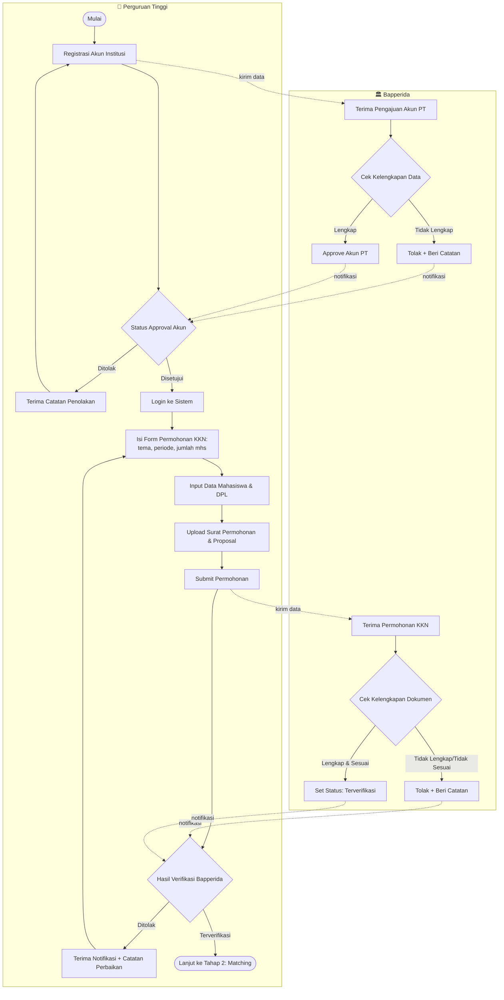
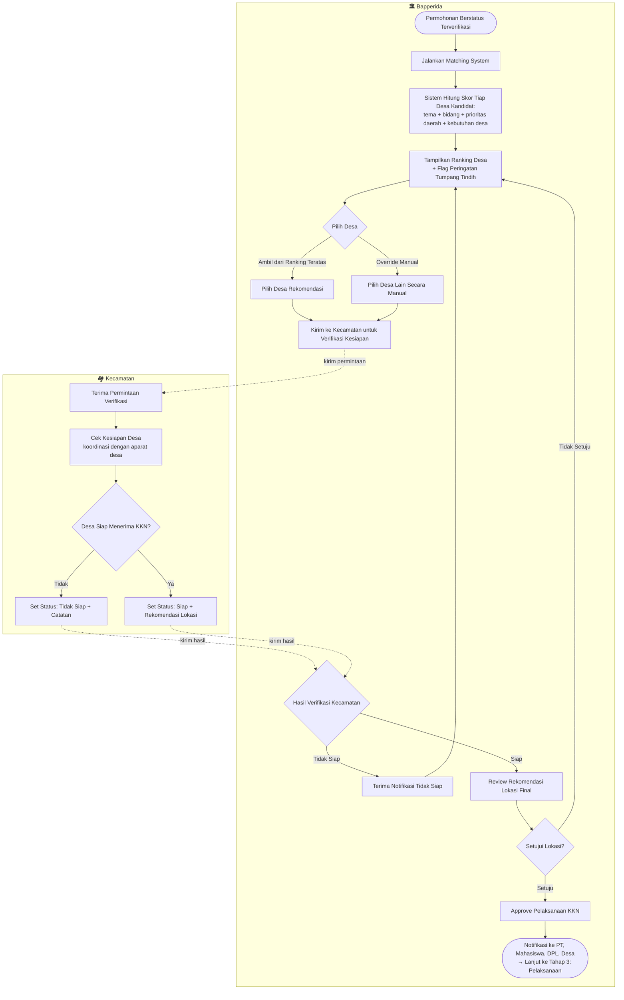
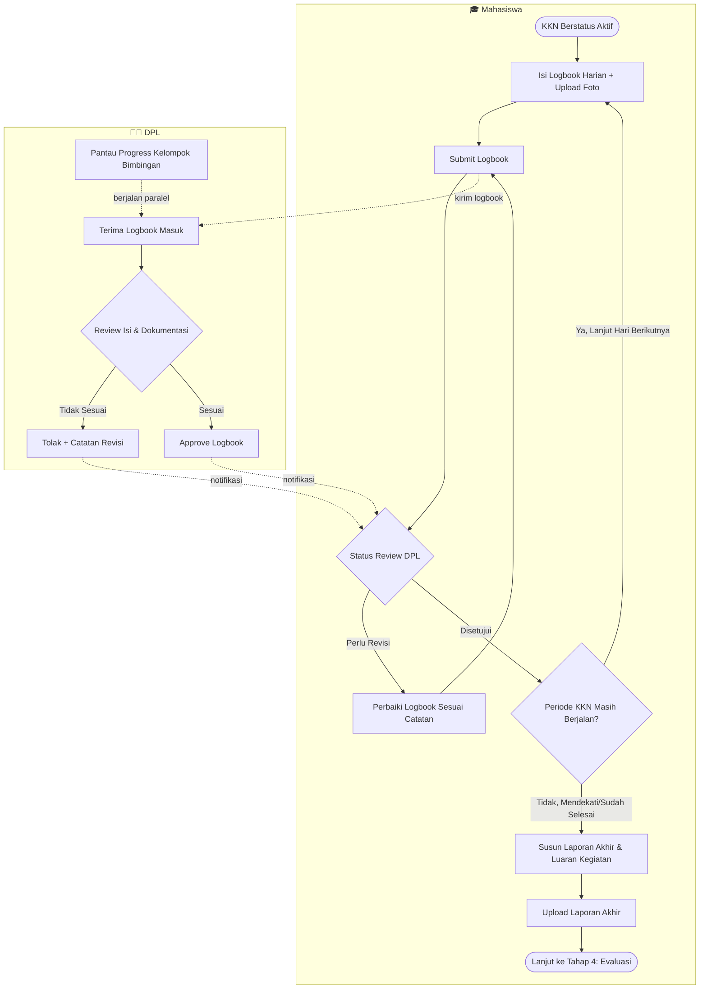
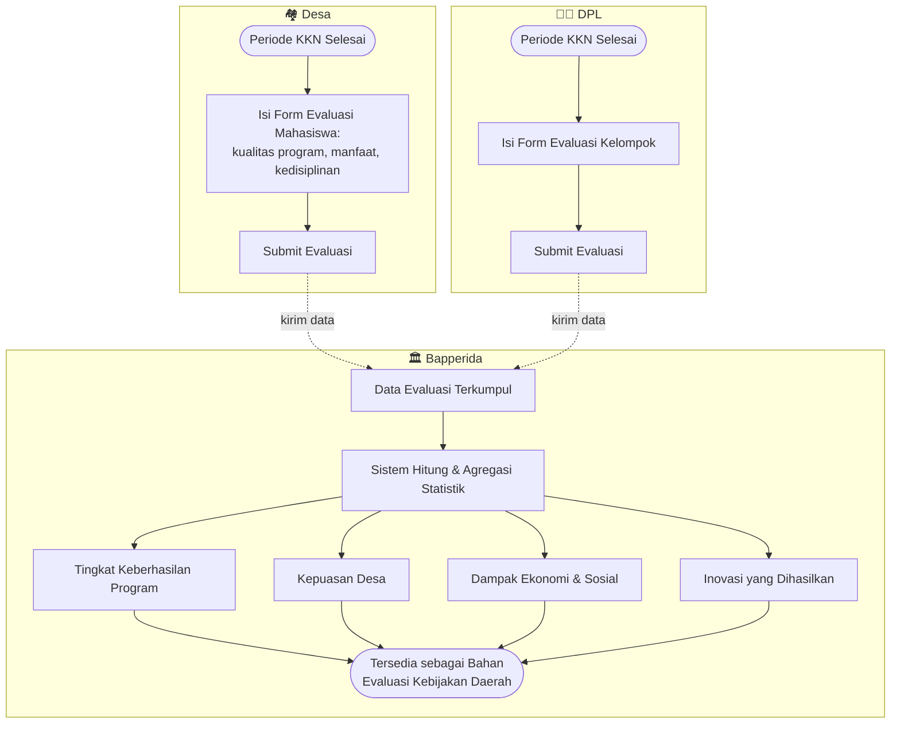
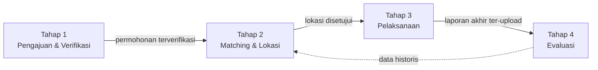

# 04 — Flowchart Proses Bisnis Utama
## SIMPUL-KKN

Dokumen sebelumnya: `00-design-system.md`, `01-prd.md`, `02-use-case.md`, `03-erd.md`

Flowchart dipecah menjadi **4 tahap** mengikuti siklus hidup KKN dalam sistem, masing-masing digambarkan dengan **swimlane per aktor** (subgraph Mermaid) dan mencakup **jalur alternatif** (ditolak/revisi), bukan hanya happy path.

```
Tahap 1: Pengajuan & Verifikasi  →  Tahap 2: Matching & Penentuan Lokasi
       →  Tahap 3: Pelaksanaan  →  Tahap 4: Evaluasi
```

---

## Tahap 1 — Pengajuan & Verifikasi

**Aktor:** Perguruan Tinggi, Bapperida
**Ref use case:** UC-01, UC-02, UC-03, UC-04, UC-05



**Catatan alur:**
- Ada **2 titik keputusan** di tahap ini: approval akun PT (sekali di awal) dan verifikasi permohonan KKN (bisa berulang tiap periode pengajuan).
- Jalur penolakan **tidak mematikan proses** — PT selalu bisa merevisi dan mengajukan ulang tanpa membuat akun/permohonan baru dari nol.

---

## Tahap 2 — Matching System & Penentuan Lokasi

**Aktor:** Bapperida, Kecamatan
**Ref use case:** UC-06, UC-07, UC-11
**Prasyarat:** Data `isu_strategis` (dari Perangkat Daerah) dan `desa_kebutuhan` (dari Desa) sudah tersedia sebagai parameter skor.



**Catatan alur:**
- Ini adalah **tahap paling kompleks** dan bisa **berulang (loop)** — jika desa hasil rekomendasi ternyata tidak siap, atau Bapperida tidak setuju hasil verifikasi kecamatan, sistem kembali ke langkah "tampilkan ranking" (M4) untuk memilih desa alternatif.
- **Flag tumpang tindih** muncul di M4 sebagai peringatan visual (bukan pemblokiran otomatis) — keputusan akhir tetap di tangan Bapperida, sesuai kesepakatan bahwa matching bersifat rule-based rekomendasi, bukan keputusan otomatis mutlak.

---

## Tahap 3 — Pelaksanaan Kegiatan

**Aktor:** Mahasiswa, DPL
**Ref use case:** UC-14, UC-15, UC-16
**Prasyarat:** Tahap 2 selesai, `kelompok_kkn.status = aktif`



**Catatan alur:**
- Loop harian (`P2 → P3 → D2 → P4 → P2`) adalah **siklus utama masa KKN**, berjalan berulang selama periode penugasan berlangsung.
- Modul Desa **tidak aktif memberi approval** di tahap ini (sesuai KAK, Desa hanya mengevaluasi di akhir — lihat Tahap 4), tapi dapat memantau progress secara pasif via Dashboard Monitoring.

---

## Tahap 4 — Evaluasi

**Aktor:** Desa, DPL, Bapperida
**Ref use case:** UC-13, UC-17, UC-09 (Dashboard Evaluasi)
**Prasyarat:** Tahap 3 selesai (laporan akhir sudah di-upload)



**Catatan alur:**
- Tahap ini **tidak punya jalur penolakan** — evaluasi bersifat input satu arah, tidak melalui proses approval berjenjang seperti tahap sebelumnya.
- Evaluasi dari Desa dan DPL bisa **submit secara paralel** (tidak saling menunggu), keduanya menjadi input agregat Dashboard Evaluasi Bapperida.
- Output tahap ini adalah **muara dari seluruh siklus KKN** — datanya menjawab langsung Tujuan #6 dan #7 di KAK (mengukur dampak & mendukung kebijakan berbasis data).

---

## Ringkasan Keterhubungan Antar Tahap



> Panah putus-putus T4 → T2: data evaluasi periode sebelumnya (mis. desa dengan evaluasi buruk, atau desa yang sudah "jenuh" menerima KKN tema sama) dapat menjadi pertimbangan tambahan pada proses matching periode berikutnya — pengembangan lanjutan dari Matching System, di luar skor dasar yang sudah disepakati.

---

*Dokumen berikutnya: `05-activity-diagram.md` — Activity Diagram per Modul*
