# 05 — Activity Diagram per Use Case
## SIMPUL-KKN

Dokumen sebelumnya: `00-design-system.md`, `01-prd.md`, `02-use-case.md`, `03-erd.md`, `04-flowchart.md`

**Perbedaan dengan `04-flowchart.md`:** flowchart sebelumnya menggambarkan alur proses **bisnis antar-aktor** (siapa menyerahkan ke siapa). Dokumen ini masuk ke **level teknis per use case** — swimlane **Aktor vs Sistem**, mencakup validasi input (format file, field wajib, cek duplikasi) dan proses paralel (fork/join) pada titik-titik yang relevan (umumnya saat submit: sistem menyimpan data + update status + kirim notifikasi sekaligus).

---

## Modul Perguruan Tinggi

### UC-01 — Registrasi Akun PT
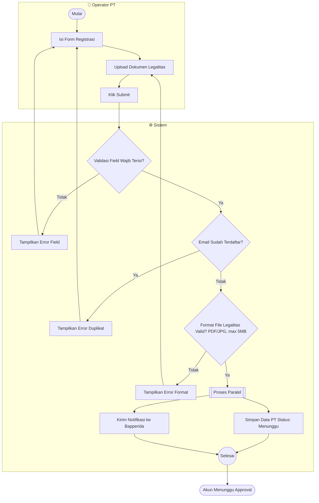
```mermaid
flowchart TB
    subgraph Aktor1["🏫 Operator PT"]
        a1([Mulai]) --> a2[Isi Form Registrasi]
        a2 --> a3[Upload Dokumen Legalitas]
        a3 --> a4[Klik Submit]
    end
    subgraph Sistem1["⚙️ Sistem"]
        s1{Validasi Field Wajib Terisi?}
        s1 -->|Tidak| s1e[Tampilkan Error Field] --> a2
        s1 -->|Ya| s2{Email Sudah Terdaftar?}
        s2 -->|Ya| s2e[Tampilkan Error Duplikat] --> a2
        s2 -->|Tidak| s3{Format File Legalitas Valid? PDF/JPG, max 5MB}
        s3 -->|Tidak| s3e[Tampilkan Error Format] --> a3
        s3 -->|Ya| fork1[["Proses Paralel"]]
        fork1 --> p1[Simpan Data PT Status: Menunggu]
        fork1 --> p2[Kirim Notifikasi ke Bapperida]
        p1 & p2 --> join1(("Selesai"))
    end
    a4 --> s1
    join1 --> z1([Akun Menunggu Approval])
```

### UC-02 — Ajukan Permohonan KKN
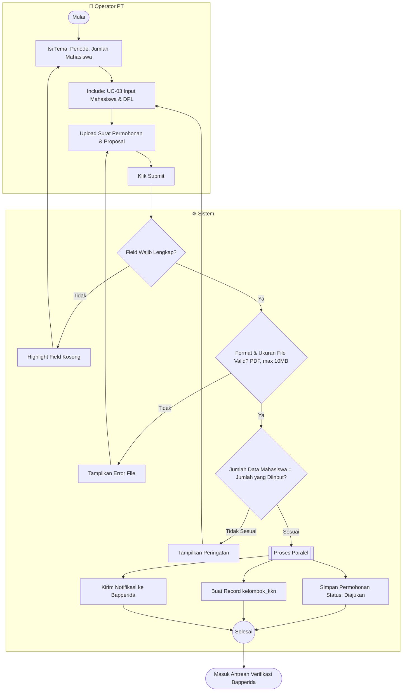
```mermaid
flowchart TB
    subgraph Aktor2["🏫 Operator PT"]
        b1([Mulai]) --> b2[Isi Tema, Periode, Jumlah Mahasiswa]
        b2 --> b3[Include: UC-03 Input Mahasiswa & DPL]
        b3 --> b4[Upload Surat Permohonan & Proposal]
        b4 --> b5[Klik Submit]
    end
    subgraph Sistem2["⚙️ Sistem"]
        c1{Field Wajib Lengkap?}
        c1 -->|Tidak| c1e[Highlight Field Kosong] --> b2
        c1 -->|Ya| c2{Format & Ukuran File Valid? PDF, max 10MB}
        c2 -->|Tidak| c2e[Tampilkan Error File] --> b4
        c2 -->|Ya| c3{Jumlah Data Mahasiswa = Jumlah yang Diinput?}
        c3 -->|Tidak Sesuai| c3e[Tampilkan Peringatan] --> b3
        c3 -->|Sesuai| fork2[["Proses Paralel"]]
        fork2 --> d1[Simpan Permohonan Status: Diajukan]
        fork2 --> d2[Buat Record kelompok_kkn]
        fork2 --> d3[Kirim Notifikasi ke Bapperida]
        d1 & d2 & d3 --> join2(("Selesai"))
    end
    b5 --> c1
    join2 --> z2([Masuk Antrean Verifikasi Bapperida])
```

### UC-03 — Input Data Mahasiswa & DPL
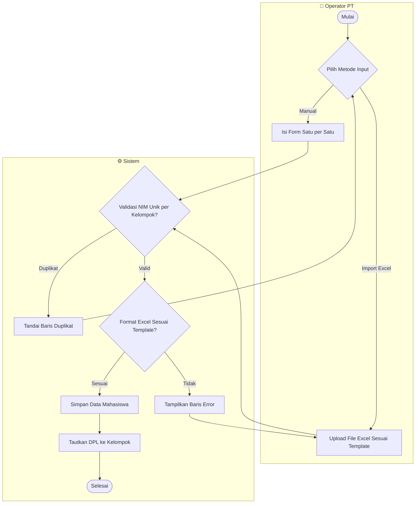
```mermaid
flowchart TB
    subgraph Aktor3["🏫 Operator PT"]
        e1([Mulai]) --> e2{Pilih Metode Input}
        e2 -->|Manual| e3[Isi Form Satu per Satu]
        e2 -->|Import Excel| e4[Upload File Excel Sesuai Template]
    end
    subgraph Sistem3["⚙️ Sistem"]
        f1{Validasi NIM Unik per Kelompok?}
        f1 -->|Duplikat| f1e[Tandai Baris Duplikat] --> e2
        f1 -->|Valid| f2{Format Excel Sesuai Template?}
        f2 -->|Tidak| f2e[Tampilkan Baris Error] --> e4
        f2 -->|Sesuai| f3[Simpan Data Mahasiswa]
        f3 --> f4[Tautkan DPL ke Kelompok]
        f4 --> f5([Selesai])
    end
    e3 --> f1
    e4 --> f1
```

### UC-04 — Pantau Status Permohonan
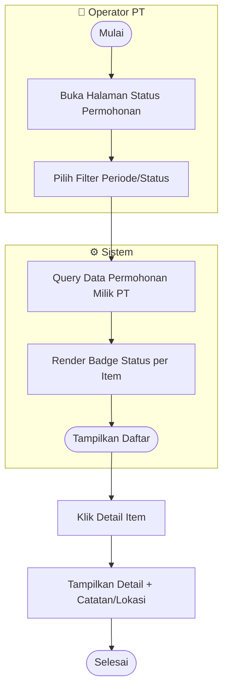
```mermaid
flowchart TB
    subgraph Aktor4["🏫 Operator PT"]
        g1([Mulai]) --> g2[Buka Halaman Status Permohonan]
        g2 --> g3[Pilih Filter Periode/Status]
    end
    subgraph Sistem4["⚙️ Sistem"]
        h1[Query Data Permohonan Milik PT]
        h1 --> h2[Render Badge Status per Item]
        h2 --> h3([Tampilkan Daftar])
    end
    g3 --> h1
    h3 --> g4[Klik Detail Item] --> h4[Tampilkan Detail + Catatan/Lokasi] --> g5([Selesai])
```

---

## Modul Bapperida

### UC-05 — Verifikasi Permohonan
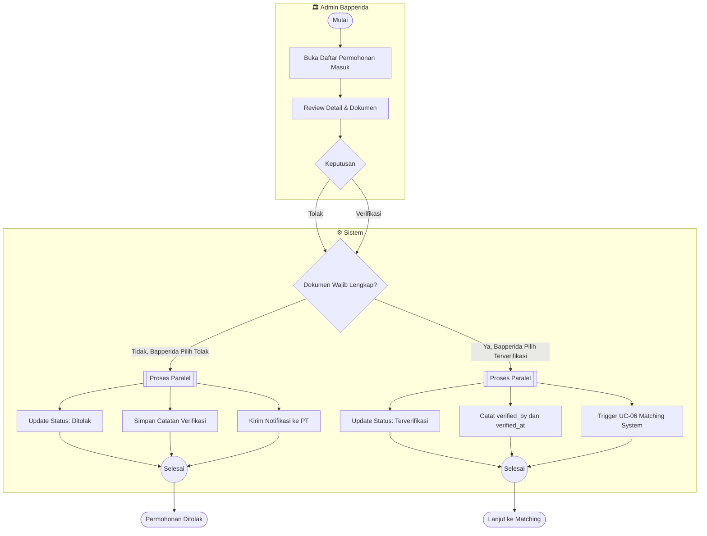
```mermaid
flowchart TB
    subgraph Aktor5["🏛️ Admin Bapperida"]
        i1([Mulai]) --> i2[Buka Daftar Permohonan Masuk]
        i2 --> i3[Review Detail & Dokumen]
        i3 --> i4{Keputusan}
    end
    subgraph Sistem5["⚙️ Sistem"]
        j1{Dokumen Wajib Lengkap?}
        j1 -->|Tidak, Bapperida Pilih Tolak| fork5a[["Proses Paralel"]]
        fork5a --> k1[Update Status: Ditolak]
        fork5a --> k2[Simpan Catatan Verifikasi]
        fork5a --> k3[Kirim Notifikasi ke PT]
        k1 & k2 & k3 --> join5a(("Selesai"))
        j1 -->|Ya, Bapperida Pilih Terverifikasi| fork5b[["Proses Paralel"]]
        fork5b --> l1[Update Status: Terverifikasi]
        fork5b --> l2[Catat verified_by dan verified_at]
        fork5b --> l3[Trigger UC-06 Matching System]
        l1 & l2 & l3 --> join5b(("Selesai"))
    end
    i4 -->|Tolak| j1
    i4 -->|Verifikasi| j1
    join5a --> z5a([Permohonan Ditolak])
    join5b --> z5b([Lanjut ke Matching])
```

### UC-06 — Jalankan Matching System
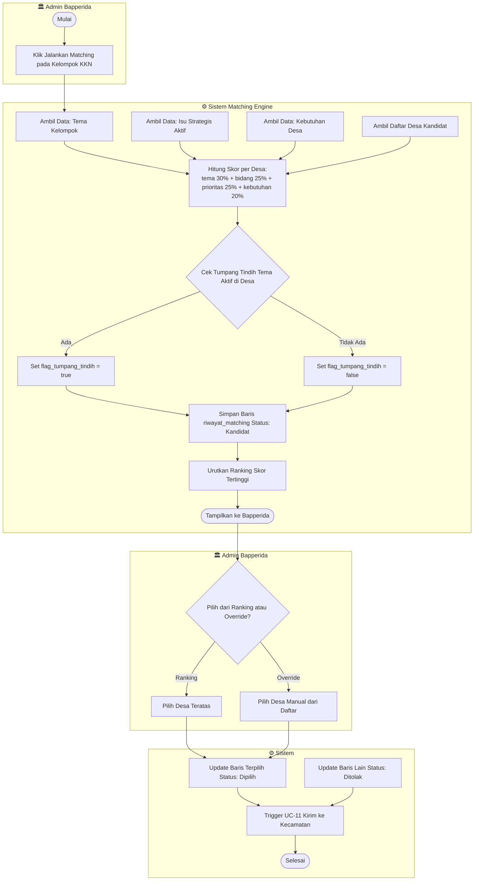
```mermaid
flowchart TB
    subgraph Aktor6["🏛️ Admin Bapperida"]
        m1([Mulai]) --> m2[Klik Jalankan Matching pada Kelompok KKN]
    end
    subgraph Sistem6["⚙️ Sistem Matching Engine"]
        n1[Ambil Data: Tema Kelompok]
        n2[Ambil Data: Isu Strategis Aktif]
        n3[Ambil Data: Kebutuhan Desa]
        n4[Ambil Daftar Desa Kandidat]
        n1 & n2 & n3 & n4 --> n5[Hitung Skor per Desa:<br/>tema 30% + bidang 25% + prioritas 25% + kebutuhan 20%]
        n5 --> n6{Cek Tumpang Tindih Tema Aktif di Desa}
        n6 -->|Ada| n6a[Set flag_tumpang_tindih = true]
        n6 -->|Tidak Ada| n6b[Set flag_tumpang_tindih = false]
        n6a & n6b --> n7[Simpan Baris riwayat_matching Status: Kandidat]
        n7 --> n8[Urutkan Ranking Skor Tertinggi]
        n8 --> n9([Tampilkan ke Bapperida])
    end
    subgraph Aktor6b["🏛️ Admin Bapperida"]
        o1{Pilih dari Ranking atau Override?}
        o1 -->|Ranking| o2[Pilih Desa Teratas]
        o1 -->|Override| o3[Pilih Desa Manual dari Daftar]
    end
    subgraph Sistem6b["⚙️ Sistem"]
        p1[Update Baris Terpilih Status: Dipilih]
        p2[Update Baris Lain Status: Ditolak]
        p1 & p2 --> p3[Trigger UC-11 Kirim ke Kecamatan]
        p3 --> p4([Selesai])
    end
    m2 --> n1
    n9 --> o1
    o2 --> p1
    o3 --> p1
```

### UC-07 — Setujui Pelaksanaan KKN
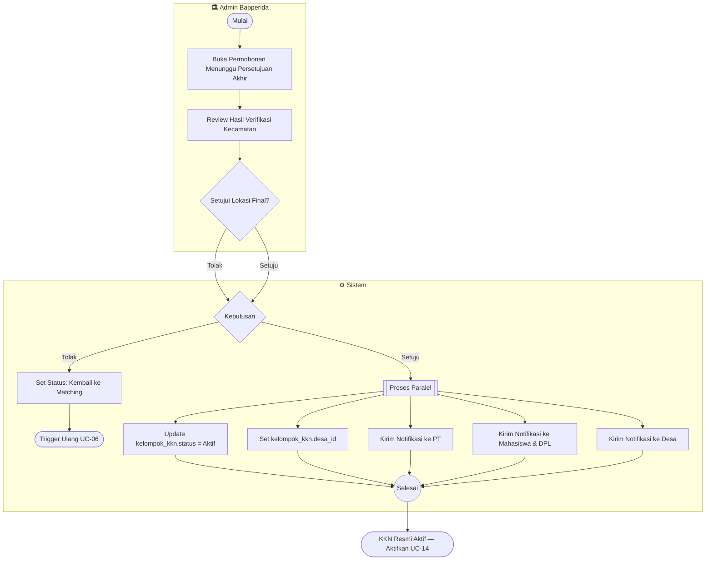
```mermaid
flowchart TB
    subgraph Aktor7["🏛️ Admin Bapperida"]
        q1([Mulai]) --> q2[Buka Permohonan Menunggu Persetujuan Akhir]
        q2 --> q3[Review Hasil Verifikasi Kecamatan]
        q3 --> q4{Setujui Lokasi Final?}
    end
    subgraph Sistem7["⚙️ Sistem"]
        r1{Keputusan}
        r1 -->|Tolak| r1a[Set Status: Kembali ke Matching] --> r1b([Trigger Ulang UC-06])
        r1 -->|Setuju| fork7[["Proses Paralel"]]
        fork7 --> s1[Update kelompok_kkn.status = Aktif]
        fork7 --> s2[Set kelompok_kkn.desa_id]
        fork7 --> s3[Kirim Notifikasi ke PT]
        fork7 --> s4[Kirim Notifikasi ke Mahasiswa & DPL]
        fork7 --> s5[Kirim Notifikasi ke Desa]
        s1 & s2 & s3 & s4 & s5 --> join7(("Selesai"))
    end
    q4 -->|Tolak| r1
    q4 -->|Setuju| r1
    join7 --> z7([KKN Resmi Aktif — Aktifkan UC-14])
```

### UC-08 — Kelola Master Data
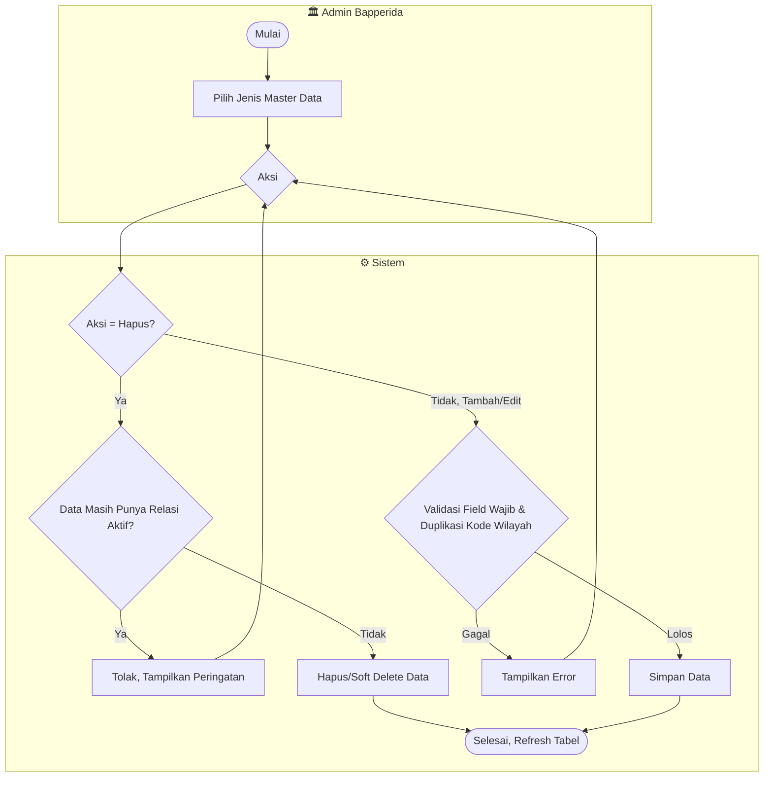
```mermaid
flowchart TB
    subgraph Aktor8["🏛️ Admin Bapperida"]
        t1([Mulai]) --> t2[Pilih Jenis Master Data]
        t2 --> t3{Aksi}
    end
    subgraph Sistem8["⚙️ Sistem"]
        u1{Aksi = Hapus?}
        u1 -->|Ya| u2{Data Masih Punya Relasi Aktif?}
        u2 -->|Ya| u2e[Tolak, Tampilkan Peringatan] --> t3
        u2 -->|Tidak| u3[Hapus/Soft Delete Data]
        u1 -->|Tidak, Tambah/Edit| u4{Validasi Field Wajib & Duplikasi Kode Wilayah}
        u4 -->|Gagal| u4e[Tampilkan Error] --> t3
        u4 -->|Lolos| u5[Simpan Data]
        u3 & u5 --> u6([Selesai, Refresh Tabel])
    end
    t3 --> u1
```

### UC-09 — Lihat Dashboard Monitoring & GIS
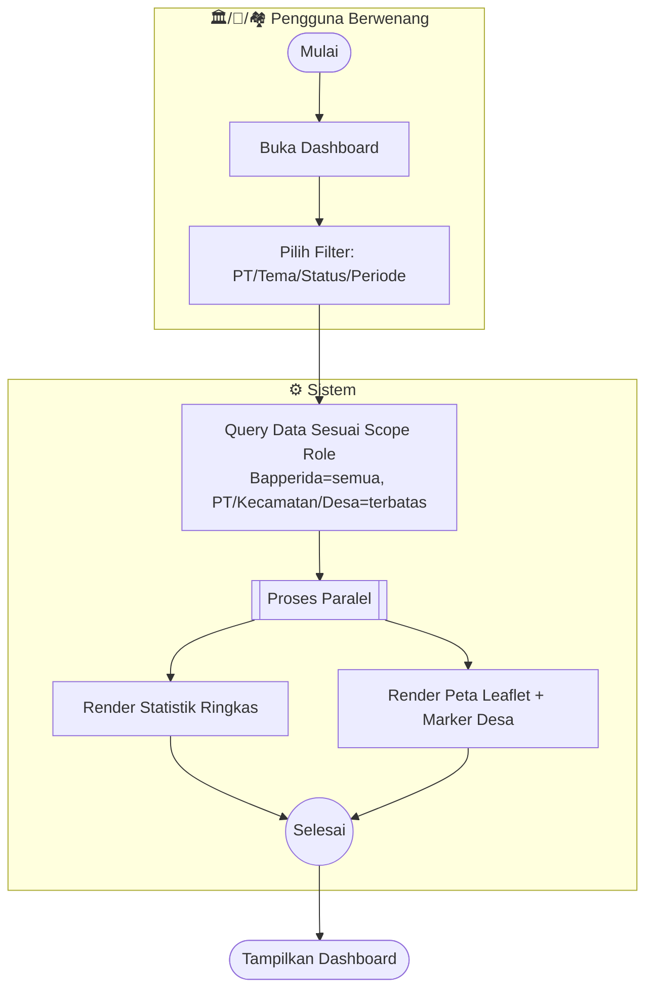
```mermaid
flowchart TB
    subgraph Aktor9["🏛️/🏫/🏘️ Pengguna Berwenang"]
        v1([Mulai]) --> v2[Buka Dashboard]
        v2 --> v3[Pilih Filter: PT/Tema/Status/Periode]
    end
    subgraph Sistem9["⚙️ Sistem"]
        w1[Query Data Sesuai Scope Role<br/>Bapperida=semua, PT/Kecamatan/Desa=terbatas]
        fork9[["Proses Paralel"]]
        w1 --> fork9
        fork9 --> x1[Render Statistik Ringkas]
        fork9 --> x2[Render Peta Leaflet + Marker Desa]
        x1 & x2 --> join9(("Selesai"))
    end
    v3 --> w1
    join9 --> z9([Tampilkan Dashboard])
```

---

## Modul Perangkat Daerah

### UC-10 — Input Isu Strategis
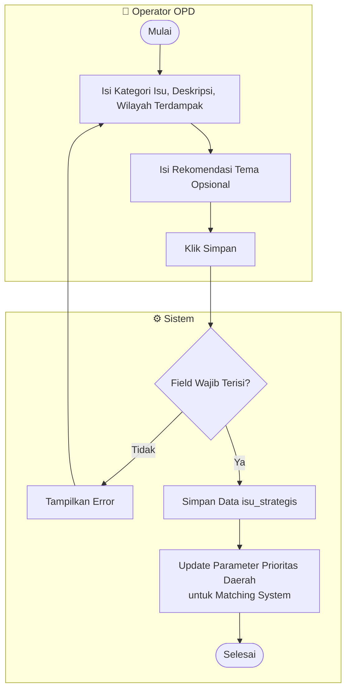
```mermaid
flowchart TB
    subgraph Aktor10["🏢 Operator OPD"]
        aa1([Mulai]) --> aa2[Isi Kategori Isu, Deskripsi, Wilayah Terdampak]
        aa2 --> aa3[Isi Rekomendasi Tema Opsional]
        aa3 --> aa4[Klik Simpan]
    end
    subgraph Sistem10["⚙️ Sistem"]
        ab1{Field Wajib Terisi?}
        ab1 -->|Tidak| ab1e[Tampilkan Error] --> aa2
        ab1 -->|Ya| ab2[Simpan Data isu_strategis]
        ab2 --> ab3[Update Parameter Prioritas Daerah<br/>untuk Matching System]
        ab3 --> ab4([Selesai])
    end
    aa4 --> ab1
```

---

## Modul Kecamatan

### UC-11 — Verifikasi Kesiapan Desa
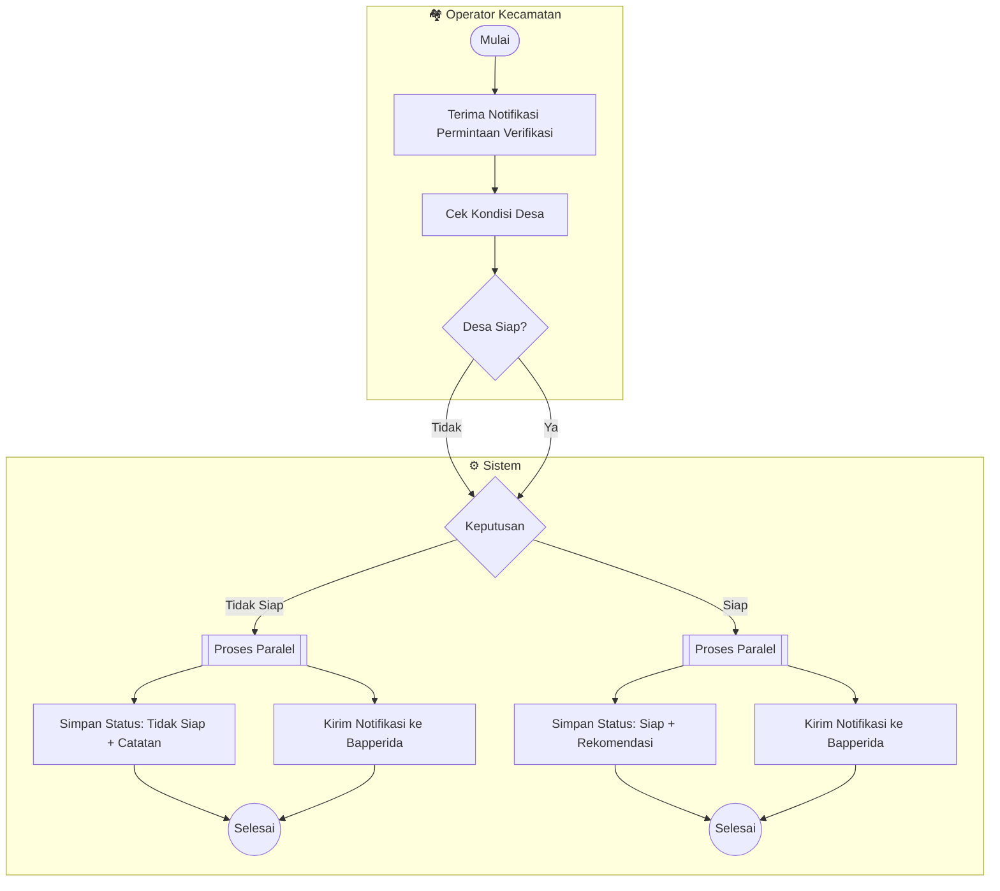
```mermaid
flowchart TB
    subgraph Aktor11["🏘️ Operator Kecamatan"]
        ac1([Mulai]) --> ac2[Terima Notifikasi Permintaan Verifikasi]
        ac2 --> ac3[Cek Kondisi Desa]
        ac3 --> ac4{Desa Siap?}
    end
    subgraph Sistem11["⚙️ Sistem"]
        ad1{Keputusan}
        ad1 -->|Tidak Siap| fork11a[["Proses Paralel"]]
        fork11a --> ae1[Simpan Status: Tidak Siap + Catatan]
        fork11a --> ae2[Kirim Notifikasi ke Bapperida]
        ae1 & ae2 --> join11a(("Selesai"))
        ad1 -->|Siap| fork11b[["Proses Paralel"]]
        fork11b --> af1[Simpan Status: Siap + Rekomendasi]
        fork11b --> af2[Kirim Notifikasi ke Bapperida]
        af1 & af2 --> join11b(("Selesai"))
    end
    ac4 -->|Tidak| ad1
    ac4 -->|Ya| ad1
```

---

## Modul Desa

### UC-12 — Kelola Profil & Potensi Desa
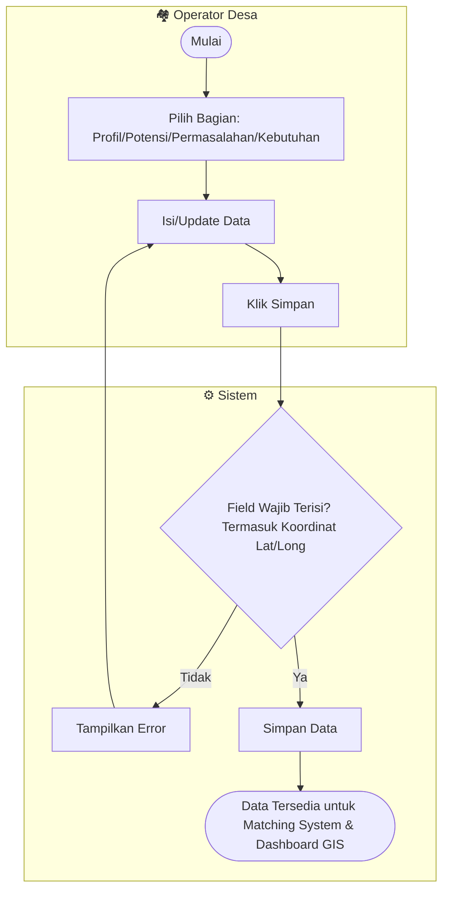
```mermaid
flowchart TB
    subgraph Aktor12["🏘️ Operator Desa"]
        ag1([Mulai]) --> ag2[Pilih Bagian: Profil/Potensi/Permasalahan/Kebutuhan]
        ag2 --> ag3[Isi/Update Data]
        ag3 --> ag4[Klik Simpan]
    end
    subgraph Sistem12["⚙️ Sistem"]
        ah1{Field Wajib Terisi? Termasuk Koordinat Lat/Long}
        ah1 -->|Tidak| ah1e[Tampilkan Error] --> ag3
        ah1 -->|Ya| ah2[Simpan Data]
        ah2 --> ah3([Data Tersedia untuk Matching System & Dashboard GIS])
    end
    ag4 --> ah1
```

### UC-13 — Evaluasi Mahasiswa
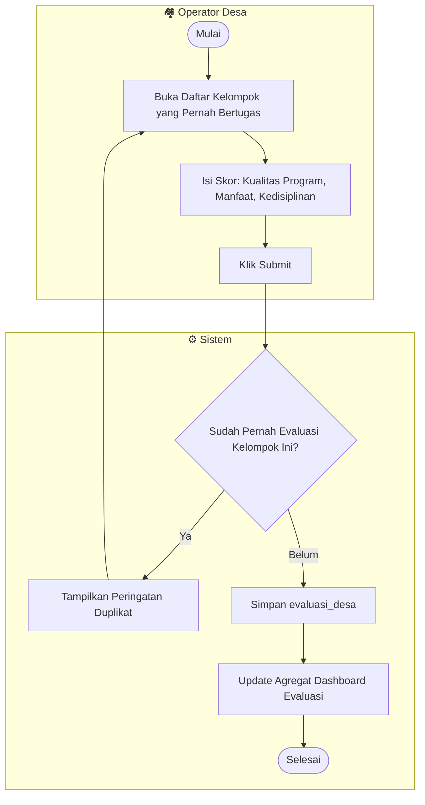
```mermaid
flowchart TB
    subgraph Aktor13["🏘️ Operator Desa"]
        ai1([Mulai]) --> ai2[Buka Daftar Kelompok yang Pernah Bertugas]
        ai2 --> ai3[Isi Skor: Kualitas Program, Manfaat, Kedisiplinan]
        ai3 --> ai4[Klik Submit]
    end
    subgraph Sistem13["⚙️ Sistem"]
        aj1{Sudah Pernah Evaluasi Kelompok Ini?}
        aj1 -->|Ya| aj1e[Tampilkan Peringatan Duplikat] --> ai2
        aj1 -->|Belum| aj2[Simpan evaluasi_desa]
        aj2 --> aj3[Update Agregat Dashboard Evaluasi]
        aj3 --> aj4([Selesai])
    end
    ai4 --> aj1
```

---

## Modul Mahasiswa

### UC-14 — Isi Logbook Harian
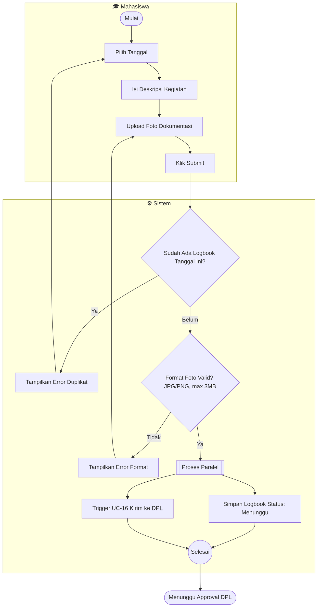
```mermaid
flowchart TB
    subgraph Aktor14["🎓 Mahasiswa"]
        ak1([Mulai]) --> ak2[Pilih Tanggal]
        ak2 --> ak3[Isi Deskripsi Kegiatan]
        ak3 --> ak4[Upload Foto Dokumentasi]
        ak4 --> ak5[Klik Submit]
    end
    subgraph Sistem14["⚙️ Sistem"]
        al1{Sudah Ada Logbook Tanggal Ini?}
        al1 -->|Ya| al1e[Tampilkan Error Duplikat] --> ak2
        al1 -->|Belum| al2{Format Foto Valid? JPG/PNG, max 3MB}
        al2 -->|Tidak| al2e[Tampilkan Error Format] --> ak4
        al2 -->|Ya| fork14[["Proses Paralel"]]
        fork14 --> am1[Simpan Logbook Status: Menunggu]
        fork14 --> am2[Trigger UC-16 Kirim ke DPL]
        am1 & am2 --> join14(("Selesai"))
    end
    ak5 --> al1
    join14 --> z14([Menunggu Approval DPL])
```

### UC-15 — Upload Laporan Akhir
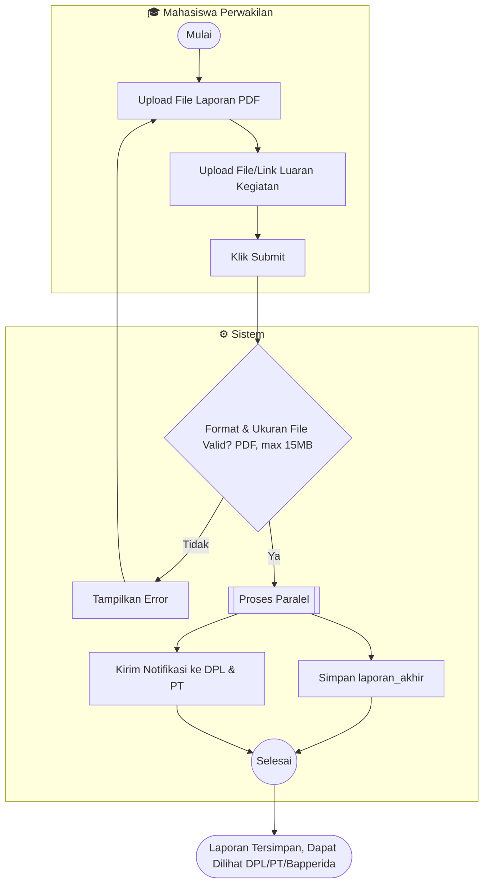
```mermaid
flowchart TB
    subgraph Aktor15["🎓 Mahasiswa Perwakilan"]
        an1([Mulai]) --> an2[Upload File Laporan PDF]
        an2 --> an3[Upload File/Link Luaran Kegiatan]
        an3 --> an4[Klik Submit]
    end
    subgraph Sistem15["⚙️ Sistem"]
        ao1{Format & Ukuran File Valid? PDF, max 15MB}
        ao1 -->|Tidak| ao1e[Tampilkan Error] --> an2
        ao1 -->|Ya| fork15[["Proses Paralel"]]
        fork15 --> ap1[Simpan laporan_akhir]
        fork15 --> ap2[Kirim Notifikasi ke DPL & PT]
        ap1 & ap2 --> join15(("Selesai"))
    end
    an4 --> ao1
    join15 --> z15([Laporan Tersimpan, Dapat Dilihat DPL/PT/Bapperida])
```

---

## Modul Dosen (DPL)

### UC-16 — Approve Logbook
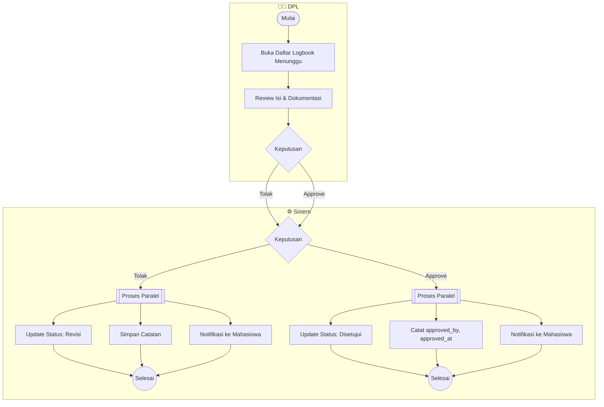
```mermaid
flowchart TB
    subgraph Aktor16["👨‍🏫 DPL"]
        aq1([Mulai]) --> aq2[Buka Daftar Logbook Menunggu]
        aq2 --> aq3[Review Isi & Dokumentasi]
        aq3 --> aq4{Keputusan}
    end
    subgraph Sistem16["⚙️ Sistem"]
        ar1{Keputusan}
        ar1 -->|Tolak| fork16a[["Proses Paralel"]]
        fork16a --> as1[Update Status: Revisi]
        fork16a --> as2[Simpan Catatan]
        fork16a --> as3[Notifikasi ke Mahasiswa]
        as1 & as2 & as3 --> join16a(("Selesai"))
        ar1 -->|Approve| fork16b[["Proses Paralel"]]
        fork16b --> at1[Update Status: Disetujui]
        fork16b --> at2[Catat approved_by, approved_at]
        fork16b --> at3[Notifikasi ke Mahasiswa]
        at1 & at2 & at3 --> join16b(("Selesai"))
    end
    aq4 -->|Tolak| ar1
    aq4 -->|Approve| ar1
```

### UC-17 — Evaluasi Kelompok
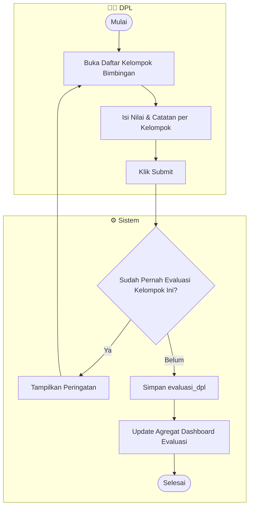
```mermaid
flowchart TB
    subgraph Aktor17["👨‍🏫 DPL"]
        au1([Mulai]) --> au2[Buka Daftar Kelompok Bimbingan]
        au2 --> au3[Isi Nilai & Catatan per Kelompok]
        au3 --> au4[Klik Submit]
    end
    subgraph Sistem17["⚙️ Sistem"]
        av1{Sudah Pernah Evaluasi Kelompok Ini?}
        av1 -->|Ya| av1e[Tampilkan Peringatan] --> au2
        av1 -->|Belum| av2[Simpan evaluasi_dpl]
        av2 --> av3[Update Agregat Dashboard Evaluasi]
        av3 --> av4([Selesai])
    end
    au4 --> av1
```

---

## Ringkasan Pola yang Berulang

Beberapa pola teknis muncul konsisten di banyak use case, dicatat di sini agar tidak diulang penjelasannya:

| Pola | Diterapkan pada | Keterangan |
|---|---|---|
| Validasi field wajib | Hampir semua UC input | Client-side (jQuery) + server-side (Laravel Validation) |
| Validasi format & ukuran file | UC-01, 02, 03, 14, 15 | Ditegakkan di server (Laravel FormRequest), pesan error spesifik per field |
| Cek duplikasi | UC-01 (email), UC-03 (NIM), UC-13/17 (evaluasi ganda) | Query unique check sebelum insert |
| Fork/join saat submit sukses | UC-01, 02, 05, 06(sebagian), 07, 11, 14, 15, 16 | Simpan data + update status + kirim notifikasi terjadi "bersamaan" secara logis (dalam satu DB transaction di Laravel, notifikasi bisa via queued job agar tidak memperlambat response) |
| Trigger ke use case lain | UC-05→06, UC-06→11, UC-14→16 | Merepresentasikan `include` relationship dari `02-use-case.md` |

---

*Dokumen berikutnya: `06-phase-plan.md` — Rencana Fase Pengembangan*
